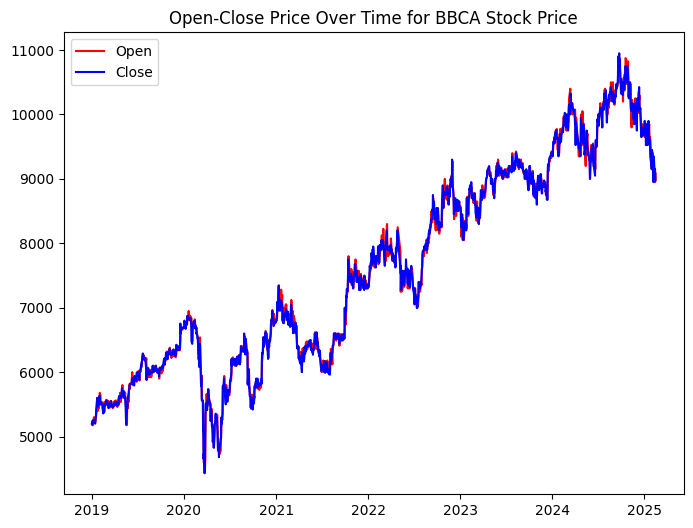
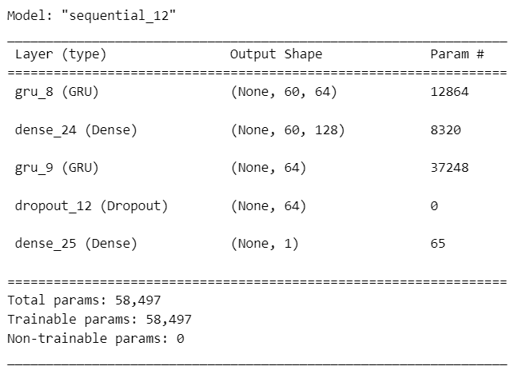
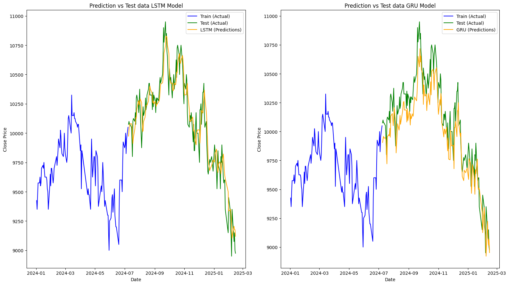

# Laporan Proyek Machine Learning - Rijal Muhammad Farizky

## Domain Proyek
Proyek ini berada dalam domain **Keuangan** dan berfokus pada prediksi harga saham, khususnya saham PT Bank Central Asia Tbk (BBCA). Peramalan harga saham adalah area yang menarik dan menantang dalam dunia keuangan karena pasar saham sangat dinamis dan dipengaruhi oleh berbagai faktor.
### Latar Belakang
Investasi saham adalah salah satu metode populer untuk meningkatkan kekayaan. Namun, pergerakan harga saham sulit diprediksi karena pasar saham sangat fluktuatif dan dipengaruhi oleh berbagai faktor, seperti indikator ekonomi, kinerja perusahaan, sentimen pasar, dan peristiwa geopolitik [1]. Peramalan harga saham yang akurat menjadi sangat penting untuk membantu investor, trader, analis keuangan, dan pembuat kebijakan dalam mengambil keputusan yang lebih tepat, optimalisasi portofolio dan mitigasi risiko [2]. Salah satu metode strategis yang sering digunakan adalah analisis dan peramalan data time series, yang memanfaatkan data historis harga saham untuk memprediksi pergerakan di masa depan [3].

Menurut data dari [id.investing.com](https://id.investing.com/equities/most-active-stocks), saham BBCA (Bank Central Asia) merupakan salah satu saham yang paling aktif diperdagangkan di Indonesia. BBCA adalah kode saham untuk PT. Bank Central Asia Tbk., sebuah bank yang beroperasi di sektor keuangan. Bank ini menjadi salah satu pemain utama di sektor keuangan Indonesia. Pada bulan **Januari 2024**, nilai kapitalisasi pasar BCA tercatat sebesar **Rp1.165 Triliun**. Proporsi nilai yang setara 10,21% dari total kapitalisasi pasar IDX [[4]](https://dataindonesia.id/pasar-saham/detail/data-8-saham-dengan-kapitalisasi-pasar-terbesar-big-caps-di-bei-per-januari-2024). Angka ini menunjukkan betapa pentingnya saham BBCA di pasar saham Indonesia, menjadikannya objek menarik untuk dianalisis dalam proyek peramalan harga saham.

## Business Understanding
### Problem Statements

1. Bagaimana cara membuat model prediksi harga saham BBCA dengan akurat dengan menggunakan data time series ?
2. Bagaimana cara menentukan model terbaik untuk prediksi harga saham BBCA?

### Goals
1. Membuat model deep learning yang dapat memprediksi harga saham BBCA berdasarkan data time series.
2. Membangun dan membandingkan 2 algoritma *deep learning* untuk mendapatkan model terbaik untuk prediksi harga saham BBCA.
### Solution Statements
1. Mengembangkan model yang dapat memprediksi harga saham BBCA yang merupakan data *time series*. Dalam hal ini menggunakan pendekatan deep learning dengan algoritma LSTM. **LSTM lebih unggul** dibandingkan algoritma deep learning lainnya seperti RNN (Recurrent Neural Network) dan CNN (Convolutional Neural Network) [[5]](https://www.researchgate.net/publication/355804252_A_Comparative_Study_of_Stock_Forecasts_by_LSTM_and_RNN_Neural_Networks). Salah satu kelebihan LSTM adalah kemampuannya mengatasi masalah vanishing gradient. *vanishing gradient* terjadi ketika gradien menjadi sangat kecil saat backpropagation, sehingga jaringan sulit untuk mempelajari pola jangka panjang. Kelebihan ini membuat LSTM mampu mempertahankan informasi temporal yang memungkinkannya untuk mempelajari pola tren harga saham secara lebih akurat [[6]](https://www.researchgate.net/publication/379811995_Stock_Market_Analysis_and_Prediction_Using_LSTM_A_Case_Study_on_Technology_Stocks).

2. Salah satu kelebihan utama dari LSTM adalah kemampuannya mengatasi masalah vanishing gradients, yang sering menjadi kendala pada jaringan saraf tradisional saat mempelajari data sequence panjang. Sebagai alternatif, algoritma **GRU (Gated Recurrent Unit)** juga memiliki keunggulan serupa, namun dengan arsitektur yang lebih sederhana dan efisien secara komputasi karena menggunakan lebih sedikit parameter. Meski GRU lebih cepat dalam proses pelatihan, pendekatan utama dalam kasus ini tetap berfokus pada akurasi prediksi. Untuk memastikan model terbaik dalam memprediksi harga saham BBCA, dilakukan perbandingan kinerja antara LSTM dan GRU. Keduanya dievaluasi menggunakan berbagai metrik, seperti **RMSE (Root Mean Square Error)**, **MAE (Mean Absolute Error)**, **MAPE (Mean Absolute Percentage Error)**, dan **RMSPE (Root Mean Square Percentage Error)**.

## Data Understanding

Dataset yang digunakan pada proyek kali ini memiliki rincian sebagai berikut.
| **Attribute**             | **Details**                                                                                      |
|----------------------------|--------------------------------------------------------------------------------------------------|
| **Dataset Name**           | Bank Central Asia Stock Historical Price                                                       |
| **Creator**                | Mario Caesar                                                                                   |
| **Source**                 | [Kaggle - Bank Central Asia Stock Historical Price](https://www.kaggle.com/datasets/caesarmario/bank-central-asia-stock-historical-price?select=BBCA.JK.csv) |
| **Upload Date**            | February 2025                                                                                  |
| **Filename**               | BBCA.JK.csv                                                                                    |
| **Number of Rows**         | 1,498                                                                                          |
| **Number of Columns**      | 7                                                                                              |

### Data Description
Data Bank Central Asia [(BBCA)](https://www.kaggle.com/datasets/caesarmario/bank-central-asia-stock-historical-price) Stock Historical Price berisi informasi harga saham BBCA (Bank Central Asia) sejumlah 1498 data *time series* mulai dari tanggal 1 Januari 2019 hingga 14 Februari 2025. Data ini mencakup 7 variabel yang memberikan gambaran lengkap tentang aktivitas perdagangan saham BBCA selama periode tersebut.

Berikut adalah **deskripsi** dari tiap **variabel dalam data** historis harga saham BBCA beserta tipe datanya:
* **Date [Object]** : Tanggal harga saham dicatat.
* **Open [Float]:** Harga saham BBCA pada awal hari perdagangan. Ini adalah harga yang disepakati pada saat pasar dibuka. 
* **High [Float]:** Harga saham BBCA tertinggi yang tercapai selama hari perdagangan. 
* **Low [Float]:** Harga saham BBCA terendah yang tercapai selama hari perdagangan. 
* **Close [Float]:** Harga saham BBCA pada akhir hari perdagangan. Ini adalah harga yang disepakati pada saat pasar ditutup.
* **Adj Close [Float]**: Harga penutupan saham yang telah disesuaikan untuk memperhitungkan Corporate Action  seperti dividen, stock split, dan lainnya. Tujuannya adalah untuk memberikan gambaran yang lebih akurat tentang kinerja saham dari waktu ke waktu.
* **Volume [Integer]:** Jumlah saham BBCA yang diperdagangkan selama hari perdagangan. Volume yang tinggi menunjukkan minat yang besar terhadap saham tersebut begitu pula sebaliknya. 

### Exploratory Data Analysis
**Pengecekan Data yang Hilang (Missing Value)**

| Column     | Missing Values |
|------------|----------------|
| Date       | 0              |
| Open       | 0              |
| High       | 0              |
| Low        | 0              |
| Close      | 0              |
| Adj Close  | 0              |
| Volume     | 0              |

Bedasarkan hasil pengecekan dengan menggunakan pandas menggunakan method `isnull().sum()` , tidak ditemukan adanya data yang hilang pada dataset.

**Pengecekan Duplikasi Data**

Bedasarkan hasil pengecekan dengan menggunakan pandas menggunakan method `duplicated()` , tidak ditemukan adanya duplikasi data pada dataset.

**Pengecekan Outlier**

Pengecekan outlier dilakukan dengan menggunakan **visualisasi boxplot**. Dari hasil visualisasi di bawah, ditemukan adanya outlier pada fitur Volume. Untuk menghitung jumlah outlier tersebut, digunakan metode **IQR (Interquartile Range)**. Dari perhitungan, diperoleh jumlah outlier pada fitur `Volume` sebanyak 75.

**Pengecekan Urutan Time Series**

Pengecekan urutan data dilakukan menggunakan method `date_diff.value_counts()` dari pandas. Hasilnya sebagai berikut.
| Days Difference | Count |
|-----------------|-------|
| 1.0             | 1153  |
| 3.0             | 287   |
| 2.0             | 22    |
| 4.0             | 17    |
| 5.0             | 10    |
| 6.0             | 5     |
| 11.0            | 2     |

Day difference menunjukkan jeda harian antara urutan data yang idealnya bernilai 1. Variasi perbedaan hari dapat disebabkan oleh berbagai faktor, seperti hari libur sehingga saham tidak diperdagangkan, missing value, atau ketidaksesuaian lainnya dalam data.

**Tren Open dan Close**

Berdasarkan visualisasi yang tersedia, dapat diamati bahwa **tren** harga saham BBCA cenderung mengalami kenaikan setiap tahunnya dan membentuk pola tertentu. Pola ini kemudian dapat dipelajari oleh model deep learning untuk membuat prediksi yang lebih akurat di masa depan.

**Tren Volume**

 

Volume saham yang diperdagangkan cenderung konsisten tiap tahunnya mengindikasikan bahwa saham tersebut memiliki likuiditas yang stabil. Likuiditas yang konsisten menandakan bahwa saham tersebut dapat diperdagangkan dengan mudah oleh investor tanpa menyebabkan perubahan harga yang signifikan, yang merupakan tanda pasar yang sehat dan aktif, meskipun volume saham melonjak cukup tinggi pada periode tertentu.

**Pergerakan Tahunan pada Fitur Close**

**Fitur Close** merupakan harga terakhir dari suatu saham pada akhir hari perdagangan. Harga ini sering digunakan sebagai referensi dalam analisis teknikal dan pengambilan keputusan trading karena mencerminkan nilai terakhir dari saham pada hari tersebut, yang biasanya dianggap lebih penting dibandingkan harga lainnya sepanjang hari. Dalam analisis ini, pergerakan rata-rata harga penutupan (Close) per tahun akan diamati.

Berdasarkan plot di atas, dapat dilihat bahwa pergerakan saham cenderung memiliki pola tertentu dan cukup konsisten tiap tahunnya. Meskipun terdapat fluktuasi bulanan, saham cenderung menunjukkan tren kenaikan dari tahun ke tahun.

**Feature Correlation**

Selanjutnya, analisis *feature correlation* akan dilakukan untuk memahami hubungan antara fitur-fitur dalam data. Visualisasi hubungan antar fitur akan dilakukan menggunakan pair plot, dan matriks korelasi akan dihitung untuk memperoleh gambaran menyeluruh tentang hubungan antar seluruh fitur numerik.

Visualisasi pair plot menunjukkan adanya korelasi antara fitur `Open`, `High`, `Low`, `Close`, dan `Adj. Close`. Sementara itu, data pada fitur Volume cenderung tersebar dan menumpuk, menunjukkan variabilitas yang tinggi dan sulit diprediksi.

Hasil perhitungan matriks korelasi menunjukkan bahwa terdapat korelasi **positif sempurna (nilai korelasi = 1)** antara fitur `Open`, `High`, `Low`, `Close`, dan `Adj. Close`. Hal ini berbanding lurus dengan visualisasi pair-plot yang telah dilakukan sebelumnya.

## Data Preparation
Berikut merupakan tahapan-tahapan dalam Data Preparation:
### Konversi Tipe Data
Pada tahap ini dilakukan konversi tipe data pada kolom `Date` yang semula *object* menjadi *datetime*. Tahap ini dilakukan untuk mempermudah proses analisis dan visualisasi pada data yang berbasis waktu.
### Feature Selection
Berdasarkan hasil analisis, fitur `Open`, `High`, `Low`, `Close`, `Adj. Close` menunjukkan korelasi positif sempurna. Hal ini berarti bahwa perubahan pada salah satu fitur akan saling memengaruhi. Oleh karena itu, salah satu dari fitur tersebut dapat dipilih untuk digunakan dalam pembangunan Model Deep Learning. Dalam hal ini, fitur `Close` akan digunakan.

### Normalisasi data dengan StandardScaler
Data diubah ke dalam **skala standar** (**rata-rata = 0**, **standar deviasi = 1**). Normalisasi ini penting agar model machine learning, khususnya yang berbasis gradient descent, dapat bekerja lebih optimal tanpa bias terhadap skala fitur yang berbeda.

### Splitting data menjadi train dan test dengan rasio 90:10
Data dibagi menjadi **90% untuk pelatihan (train)** dan **10% untuk pengujian (test)**. Rasio ini memastikan model memiliki cukup data untuk belajar sambil tetap menyediakan data pengujian untuk mengevaluasi kinerjanya pada data baru yang belum pernah dilihat sebelumnya.

### Windowing
Windowing adalah proses penting dalam analisis data deret waktu (time series). Dalam prosesnya, windowing membagi datas menjadi beberapa subset atau window dengan ukuran tertentu yang dikenal sebagai `window size`. Dalam kasus ini, window dibuat dengan ukuran **60 hari**. Hasil proses ini sebagai berikut.

## Modeling
Pada tahap ini, model **LSTM** dan **GRU** akan dibangun dengan menggunakan parameter yang sama. Berikut adalah konfigurasi model yang akan digunakan:
| Parameter                      | Value      |
|--------------------------------|------------|
| **EPOCHS**                     | 20         |
| **Hidden Layer**               | 128 units  |
| **Activation Function**        | Adam       |
| **Look Back Value / Window**   | 60         |
| **Dropout**                    | 0.2        |
| **Loss Function**              | MAE        |
| **Metric Function**            | RMSE       |
### LSTM Model
**LSTM (Long Short-Term Memory)** adalah jenis jaringan saraf berulang (RNN) yang dirancang untuk mengenali pola dalam data deret waktu (time series). **Keunggulan LSTM  **terletak pada kemampuannya untuk menyimpan informasi dalam jangka waktu yang lebih panjang, berkat penggunaan tiga jenis *gate*: *gate* input, *gate* output, dan *gate* forget.
Berikut merupakan arsitektur model yang dibangun pada proyek ini.

**Penjelasan Aliran data pada Model:**

Model dimulai dengan menerima *input* deret waktu. Data tersebut masuk ke *layer* LSTM pertama yang terdiri dari 64 unit. Di dalam *layer* ini, terdapat tiga *gate* utama yaitu *gate input*, *gate forget*, dan *gate output*. *Gate input* memutuskan seberapa banyak informasi baru yang akan disimpan dalam sel memori berdasarkan *input* saat ini, *gate forget* menentukan seberapa banyak informasi dari sel memori sebelumnya yang akan dilupakan, dan *gate output* menentukan seberapa banyak informasi dari sel memori yang akan dikeluarkan sebagai output. Karena return_sequences=True, seluruh *output sequence* dari setiap waktu akan diteruskan ke lapisan berikutnya.

Setelah melewati *layer* LSTM pertama, data diteruskan ke *layer* Dense dengan 128 unit dan fungsi aktivasi ReLU. *Layer* Dense ini menghubungkan setiap neuron dari *layer* LSTM ke setiap neuron dalam *layer* ini, memungkinkan model untuk mempelajari hubungan non-linear dalam data. Ini adalah tahap di mana model belajar untuk mengenali pola-pola kompleks yang mungkin tidak dapat ditangkap oleh *layer* LSTM saja.

Data yang telah diproses oleh *layer* Dense kemudian kembali diteruskan ke *layer* LSTM kedua dengan 64 unit. Kali ini, return_sequences=False berarti hanya keluaran terakhir dari urutan yang akan diteruskan ke *layer* berikutnya, bukan seluruh urutan. Ini berarti *layer* LSTM kedua menyaring informasi agar lebih ringkas sebelum diteruskan ke *layer* berikutnya.

Selanjutnya, data memasuki *layer* Dropout dengan nilai dropout sebesar 20% (0.2). *Layer* ini berfungsi untuk mengurangi *overfitting* dengan secara acak menonaktifkan 20% neuron selama pelatihan. Dropout membantu model menjadi lebih robust dan meningkatkan generalisasi pada data baru yang belum pernah dilihat sebelumnya.

Akhirnya, data diteruskan ke lapisan Dense terakhir dengan 1 unit. *Layer* ini menghasilkan output akhir dari model, yang dalam kasus ini adalah nilai prediksi tunggal. *Layer* ini mengubah keluaran dari lapisan sebelumnya menjadi bentuk yang sesuai untuk prediksi akhir, seperti harga saham pada satu waktu tertentu.

### GRU/Model

Dengan kelebihan serupa dengan LSTM, **GRU** hadir dengan arsitektur cenderung lebih sederhana dengan memanfaatkan *gate reset* dan *gate update* Berikut merupakan arsitektur model GRU

**Penjelasan Aliran data pada Model:**

Model GRU dimulai dengan menerima input data deret waktu yang kemudian masuk ke lapisan GRU pertama dengan 64 unit. Lapisan ini memanfaatkan mekanisme *gate reset* dan *gate update* untuk mengelola informasi. Gerbang reset memungkinkan model melupakan informasi yang tidak relevan, sementara gerbang update menentukan informasi baru yang akan disimpan. Dengan return_sequences=True, seluruh urutan keluaran dari setiap langkah waktu diteruskan ke lapisan berikutnya.

Setelah diproses oleh lapisan GRU pertama, data diteruskan ke lapisan Dense dengan 128 unit dan fungsi aktivasi ReLU. Lapisan ini menghubungkan neuron dari lapisan GRU sebelumnya dengan setiap neuron dalam lapisan Dense, memungkinkan model untuk mengenali pola-pola non-linear dalam data.

Berikutnya, data yang telah diproses oleh lapisan Dense diteruskan ke lapisan GRU kedua yang juga memiliki 64 unit. Pada tahap ini, return_sequences=False yang berarti hanya keluaran terakhir dari urutan yang diteruskan ke *layer* selanjutnya.

Pada *layer* selanjutnya, data masuk ke lapisan Dropout dengan tingkat dropout sebesar 20% (0.2). Lapisan Dropout ini berfungsi untuk mengurangi risiko overfitting dengan secara acak menonaktifkan sejumlah neuron selama pelatihan. 
Akhirnya, data diteruskan ke lapisan Dense terakhir dengan 1 unit. Lapisan ini bertugas menghasilkan output akhir dari model, yaitu prediksi tunggal / nilai prediksi harga saham.

## Evaluation

### Perbandingan Train Loss and Validation Loss

- **Grafik LSTM** menunjukkan bahwa train loss cenderung stabil dan memiliki nilai yang relatif rendah seiring bertambahnya epoch. Namun, validation loss menunjukkan fluktuasi yang signifikan dan tidak stabil. Hal ini bisa mengindikasikan adanya overfitting, di mana model bekerja dengan baik pada data training tetapi kurang baik pada data validasi. Namun, di akhir epochs, validation loss akhirnya mampu menunjukkan nilai yang mendekati nilai akhir dari train loss.
- **Pada grafik GRU**, train loss juga menurun dan stabil di nilai rendah seiring bertambahnya epoch.
Sama seperti LSTM, validation loss pada GRU juga berfluktuasi tetapi dengan pola yang lebih terlihat dibandingkan LSTM. Fluktuasi ini mungkin menandakan bahwa model belum berhasil menangkap pola secara konsisten pada data validasi. Di akhir epochs pun validation loss memperoleh nilai yang jauh dari nilai train loss.

### Perbandingan Hasil Prediksi vs Data Tes

- Prediksi menggunakan **LSTM** `(garis oranye)` memiliki pola yang cukup mirip dengan data aktual pada test set `(garis hijau)`. Hal ini menunjukkan bahwa LSTM dapat menangkap tren data dengan baik. Pada beberapa titik, prediksi sedikit melenceng dari data aktual, terutama saat terjadi perubahan tajam (spike). Secara keseluruhan, model mampu mempertahankan akurasi yang baik untuk data test.

- Prediksi menggunakan **GRU** `(garis oranye)` juga hampir serupa dengan LSTM. Perbedaannya pada model GRU cenderung melenceng lebih jauh dibandingkan model LSTM. Meskipun begitu, secara keseluruhan model masih mampu mempertahankan akurasi yang cukup baik untuk data test.

### Perbandingan Metrik Evaluasi
Pada tahap ini, perbandingan antara model LSTM dan GRU akan dilakukan menggunakan berbagai metrik seperti berikut.
| **Metrik** | **Deskripsi**                                                                                                                                         |
|------------|---------------------------------------------------------------------------------------------------------------------------------------------------------|
| **MAE**    | Untuk menunjukkan seberapa besar deviasi prediksi dari data sebenarnya secara umum.       |
| **RMSE**   | Untuk mendeteksi kesalahan yang lebih besar.                                              |
| **MAPE**   | Untuk memudahkan keterbacaan MAE karena menyajikan bobot dalam bentuk persentase.         |
| **RSMPE**  | Sama halnya dengan MAPE, tetapi untuk mendeteksi kesalahan yang lebih besar               |

**Deskripsi Hasil:**
* MAE: LSTM (115.90) lebih rendah daripada GRU (151.86), menunjukkan prediksi LSTM lebih akurat secara rata-rata.
* RMSE: LSTM (142.50) lebih kecil dibandingkan GRU (186.95), menunjukkan LSTM memiliki kesalahan yang lebih kecil pada kasus ekstrem.
* MAPE: LSTM (1.16%) lebih rendah dibanding GRU (1.43%), menegaskan bahwa LSTM memiliki tingkat kesalahan relatif yang lebih kecil terhadap nilai aktual.
* RSMPE: LSTM (1.43%) lebih kecil dari GRU (1.83%), memperkuat bahwa LSTM memberikan prediksi lebih stabil dibanding GRU.

**Kesimpulan:**

**LSTM lebih unggul dalam semua metrik dibandingkan GRU, menunjukkan bahwa model LSTM memberikan prediksi yang lebih akurat, stabil, dan responsif terhadap data. Oleh karena itu, LSTM adalah pilihan yang lebih baik untuk memprediksi harga saham BBCA.**

## Referensi

[[1] Otoritas Jasa Keuangan (OJK). "Pasar Modal." Diakses pada 16 Mei 2024.](https://www.ojk.go.id/id/kanal/pasar-modal/)

[[2] R. J. Hyndman dan G. Athanasopoulos, Forecasting: principles and practice. OTexts, 2018.](https://robjhyndman.com/uwafiles/fpp-notes.pdf)

[[3] Bursa Efek Indonesia (BEI). "Pengantar Analisis Teknikal." Diakses pada 16 Mei 2024.](https://www.idx.co.id/edukasi/artikel/pengantar-analisis-teknikal/)

[[4] Winarini. “Data 8 Saham dengan Kapitalisasi Pasar Terbesar (Big Caps) di BEI Per Januari 2024.” Dataindonesia.id, 2024.](https://dataindonesia.id/pasar-saham/detail/data-8-saham-dengan-kapitalisasi-pasar-terbesar-big-caps-di-bei-per-januari-2024)

[[5] A. Sharma, B. Singh, dan C. Kumar, "A Comparative Study of Stock Forecasts by LSTM and RNN Neural Networks".](https://www.researchgate.net/publication/340636297_Stock_Market_Prediction_Using_LSTM_Recurrent_Neural_Network)

[[6] D. Patel, E. Reddy, dan F. Shah, "Stock Market Analysis and Prediction Using LSTM: A Case Study on Technology Stocks"](https://www.researchgate.net/publication/379811995_Stock_Market_Analysis_and_Prediction_Using_LSTM_A_Case_Study_on_Technology_Stocks)
